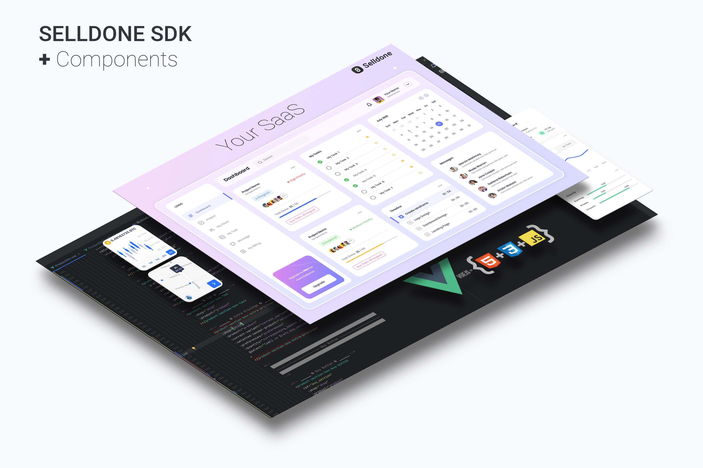
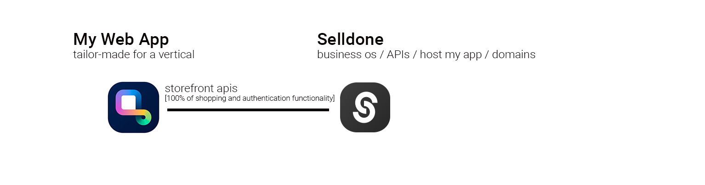

<a href="https://www.npmjs.com/package/@selldone/sdk-storefront"></a>


# Selldone ⮕ Storefront SDK


* **Mode:** 🌍 Public
* **Use case:** To build custom storefront layout for shops that created by Selldone with ready to use SDK.
* **Project Type:** JS Library

🛍️ Go to the [**Full Storefront Project ▶**](https://github.com/selldone/storefront)

A powerful toolkit that enables developers and entrepreneurs to easily create highly customized ecommerce platforms. In this article, we'll explore the capabilities of the Selldone SDK and how it can revolutionize the ecommerce landscape.


## Installation

To install Selldone Core in your project, use the following command:


```bash
npm install @selldone/sdk-storefront
```
```bash
yarn add @selldone/sdk-storefront
```

## Usage

Here's a basic example to get you started:

```javascript
import {StorefrontSDK} from "@selldone/sdk-storefront";

// ━━━ Storefront SDK (xapi,...) ━━━
StorefrontSDK.Setup(); // Set up the Shop SDK.
```

## Add Meta Tags to HTML
To integrate your web application with the Selldone ecosystem effectively, it's essential to embed specific meta tags within the <head> section of your HTML. These tags enable the Selldone SDK to establish a connection with the Selldone API, facilitating the retrieval of your shop's data.

```html
<!-- 🏬 Shop Name -->
<meta name="shop-name" content="toysworld">

<!-- 🎗 Prefix address of app Ex./my-shop-path -->
<meta name="shop-prefix-address" content="">

<!-- 📰 Shop custom page -->
<meta name="custom-home" content="shop">
```


## Selldone SDK - A Comprehensive Toolkit for Custom Ecommerce Development

The Selldone SDK is a comprehensive software development kit that contains all the essential components needed to create an online storefront and manage customer authentication. By utilizing the open-source components provided by the SDK, developers can create custom ecommerce platforms tailored to their specific needs.




## Designed for Ease of Use

Selldone SDK guarantees that even people with a mere three months of JavaScript and HTML experience can create a fully customized online store within a day. This user-friendliness makes it a popular choice for both developers and entrepreneurs, as it significantly lowers the entry barriers in the ecommerce industry.

## Limitless Customization and Application Development

The SDK enables developers to apply any level of customization to the open-source components, allowing them to construct various application layers on top of Selldone. This versatility empowers developers to create highly specialized ecommerce solutions for different verticals and even sell their tailored applications as SaaS products.

## Innovative SaaS Solutions with Selldone SDK

With Selldone SDK, you can create an extensive array of SaaS solutions without penning a single line of backend code. For instance, you could develop a subscription service for marketing analysis that allows users to sell their content through a dedicated user interface tailored to their market. Another possibility is creating a platform to help entrepreneurs sell training courses on their domain through your SaaS and unique paywall user interface - all backed by Selldone.

### Case Study 1: [Host web app on my backend]

I want to create a SaaS platform enabling market analyzers and companies to sell their signals and content on their domain. My to-do list will be:

1. Create an application with Selldone components.
2. Create a website with a home page and onboarding.
3. Define my subscription plans on payment providers (like Stripe), do some coding to sell subscriptions, and host my designed web app.
4. Now my users can subscribe to my service, connect their Selldone shop to it, and offer their services through it.


In this scenario, you directly charge your customers, and you have the flexibility to offer more features to your customers. But also, you should handle adding domains and issuing SSL on your backend.

### Case Study 2: [Host web app on Selldone]

In this scenario, my to-do list will be:

1. Create a custom web app with Selldone components.
2. Register as a SaaS owner on Selldone and verify.
3. Deploy my web app on Selldone and charge users via a subscription fee on Selldone.
4. In this setup, your primary responsibility is to develop a web app (frontend). At the same time, Selldone takes care of all the technical aspects, such as domain management, SSL issuance, and web app hosting. This allows you to focus on creating a unique and engaging user experience while Selldone handles the backend complexities.



### Imagine Then Build by AI + Selldone

Select a vertical that interests you and aligns with your expertise – the more specific and niche, the better. Next, use Midjourny to design your application layer and request code implementation using Selldone Components. Customize the components to match your design by employing AI services such as ChatGPT, BART, or even our built-in AI offerings (with fine-tuned models provided). Finally, launch your new platform-based business and explore the endless possibilities that come with it.

## Author
Pajuhaan


---

## License
**Selldone Ecosystem License Agreement**

1. **Scope of License**: This license is granted exclusively for the use of the enclosed code (hereinafter referred to as "the Code") within the Selldone ecosystem. The licensee is authorized to use the Code solely in conjunction with services and applications that are part of, or directly related to, the Selldone ecosystem.

2. **Commercial Use Restriction**: The licensee is strictly prohibited from using the Code for any commercial purposes outside the Selldone ecosystem. Commercial utilization is permissible only when it is within the Selldone ecosystem and in accordance with the terms of this agreement.

3. **Permission for Free Use**: The Code may be used for non-commercial, free services, provided that explicit credit is given to Selldone. This credit must include the name "Selldone" prominently displayed on the user interface of the relevant service or application, along with a hyperlink to [selldone.com](https://selldone.com).

4. **No Redistribution**: The licensee may not redistribute the Code, in whole or in part, to any third party outside the Selldone ecosystem, unless expressly authorized by Selldone.

5. **No Modification for Redistribution**: While modifications to the Code for personal or internal use within the Selldone ecosystem are allowed, the licensee may not modify the Code for the purpose of redistribution outside the Selldone ecosystem.

6. **Termination**: Failure to comply with the terms of this agreement will result in the immediate termination of the license and may subject the licensee to legal action.

7. **Disclaimer of Warranty**: The Code is provided "as is" without any warranties of any kind, either expressed or implied, including but not limited to implied warranties of merchantability or fitness for a particular purpose.

8. **Limitation of Liability**: In no event shall Selldone be liable for any damages arising out of the use or inability to use the Code.

9. **Jurisdiction and Disputes**: This agreement shall be governed by the laws of the jurisdiction where Selldone is established. Any disputes arising from this agreement shall be resolved in the courts of that jurisdiction.

By using the Code, the licensee acknowledges that they have read, understood, and agreed to the terms of this license.

---