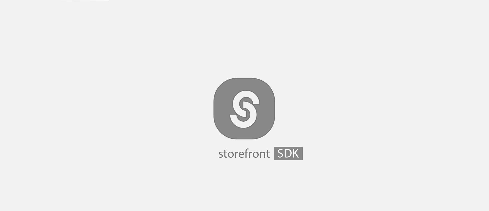
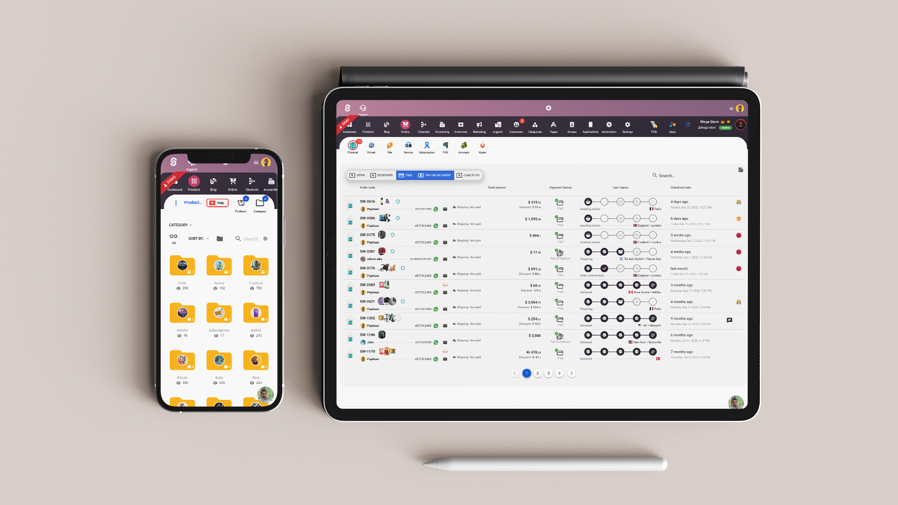
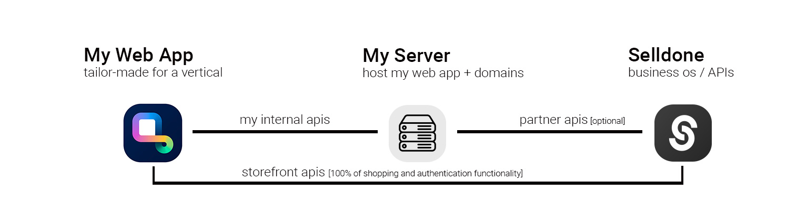

<a href="https://www.npmjs.com/package/@selldone/sdk-storefront"></a>


# Selldone ⮕ Storefront SDK

* **Mode:** 🌍 Public
* **Use case:** To build custom storefront layout for shops that created by Selldone with ready to use SDK.
* **Project Type:** JS Library

🛍️ Go to the [**Full Storefront Project ▶**](https://github.com/selldone/storefront)

A powerful toolkit that enables developers and entrepreneurs to easily create highly customized ecommerce platforms. In
this article, we'll explore the capabilities of the Selldone SDK and how it can revolutionize the ecommerce landscape.

# Documents

| Category                   | Description                                                                                                                                                     | Namespace                     |
|----------------------------|-----------------------------------------------------------------------------------------------------------------------------------------------------------------|-------------------------------|
| **[Authentication](auth)** | User authentication methods with social, sms, email                                                                                                             | `window.$storefront.auth`     |
| **[Product](product)**     | Retrieve product listings, detailed information, search for products, manage customer-related actions such as rating products, and access subscription content. | `window.$storefront.products` |
| **[Basket](basket)**       | Create order, add and remove items and checkout.                                                                                                                | `window.$storefront.basket`   |

# Starter

## Installation

To install Selldone Core in your project, use the following command:

```bash
npm install @selldone/sdk-storefront
```

```bash
yarn add @selldone/sdk-storefront
```

## Usage

Here's a basic example to get you started:

### Use in Vue, React, Bootstrap, or any other JS Framework

```javascript
import {StorefrontSDK} from "@selldone/sdk-storefront";

// ━━━ Storefront SDK (xapi,...) ━━━
StorefrontSDK.Setup(); // Set up the Shop SDK.
```

### Use in Html

```html  

<script src="https://cdn.jsdelivr.net/npm/@selldone/sdk-storefront@1.0.12/dist/bundle.min.js"></script>
<script>
    // Use the global variable StorefrontSDK
    const sdk = storefront.StorefrontSDK;
    sdk.Setup()
</script>
```

⚡ Change `1.0.12` to last version: <a href="https://www.npmjs.com/package/@selldone/sdk-storefront"></a>

### Add Meta Tags to HTML

To integrate your web application with the Selldone ecosystem effectively, it's essential to embed specific meta tags
within the <head> section of your HTML. These tags enable the Selldone SDK to establish a connection with the Selldone
API, facilitating the retrieval of your shop's data.

```html
<!-- 🏬 Shop Name -->
<meta name="shop-name" content="toysworld">

<!-- 🎗 Prefix address of app Ex./my-shop-path -->
<meta name="shop-prefix-address" content="">

<!-- 📰 Shop custom page -->
<meta name="custom-home" content="shop">


<!-- ―――――――――――――――― Start ❯ Business OS Configuration ―――――――――――――――― -->

<!-- 🪁 Service Origin -->
<meta content="https://selldone.com" name="service-url">


<!-- 🎯 APIs -->
<meta content="https://gapi.selldone.com" name="selldone-gapi">
<meta content="https://xapi.selldone.com" name="selldone-xapi">
<meta content="https://iframe.selldone.com" name="selldone-iframe">
<meta content="https://capi.selldone.com" name="selldone-capi">

<!-- 🌍 CDNs -->
<meta content="https://selldone.com/cdn-shop-images-1" name="selldone-cdn-images">
<meta content="https://selldone.com/cdn-shop-jsons-1" name="selldone-cdn-jsons">
<meta content="https://selldone.com/cdn-videos" name="selldone-cdn-videos">
<meta content="https://selldone.com/cdn-shop-temp-files" name="selldone-cdn-temp-files">
<meta content="https://selldone.com/cdn-ar" name="selldone-cdn-ar">
<meta content="https://selldone.com/cdn-id" name="selldone-cdn-id">
<meta content="true" name="storage-redirect">
<meta content="https://cdn.selldone.com" name="storage-redirect-host">
<meta content="true" name="storage-redirect-thumbnails">

```

## Articles & Live Samples

* **Medium Article:** [Build E-Commerce with Open-Source Selldone — Fetch List of Products + Vue3 Sample](https://pajuhaan.medium.com/build-e-commerce-with-open-source-selldone-fetch-list-of-products-vue3-sample-9e61108b0ca6)
* **Live Sample Code:** https://codepen.io/pajuhaan/pen/pomvQWr

# About

### Selldone SDK - Custom Ecommerce Development Toolkit

The Selldone SDK offers essential components for creating online storefronts and managing customer authentication. With
its open-source tools, developers can build custom ecommerce platforms tailored to specific needs.



### Easy to Use

Even with just three months of JavaScript and HTML experience, users can create a fully customized online store in a
day, making Selldone SDK ideal for developers and entrepreneurs alike.

### Unlimited Customization

The SDK allows for extensive customization of components, enabling developers to build specialized ecommerce solutions
for various industries and sell them as SaaS products.

### SaaS Solutions with Selldone SDK

Develop SaaS solutions without backend coding. For instance, create a subscription service for marketing analysis or a
platform for selling training courses, all powered by Selldone.

#### Case Study 1: Host Web App on My Backend

1. Create an app with Selldone components.
2. Develop a website with a home page and onboarding.
3. Define subscription plans, code to sell subscriptions, and host the web app.
4. Users subscribe, connect their Selldone shop, and offer their services.



#### Case Study 2: Host Web App on Selldone

1. Create a custom web app with Selldone components.
2. Register and verify as a SaaS owner on Selldone.
3. Deploy the web app on Selldone and charge users via Selldone's subscription service.


### Build with AI + Selldone

Choose a niche, design your application layer with Midjourny, and request code implementation using Selldone Components.
Customize components with AI services like ChatGPT, BART, or Selldone's AI offerings, and launch your platform-based
business.

## Author

Pajuhaan

## License

**Selldone Ecosystem License Agreement**

1. **Scope of License**: This license is granted exclusively for the use of the enclosed code (hereinafter referred to
   as "the Code") within the Selldone ecosystem. The licensee is authorized to use the Code solely in conjunction with
   services and applications that are part of, or directly related to, the Selldone ecosystem.

2. **Commercial Use Restriction**: The licensee is strictly prohibited from using the Code for any commercial purposes
   outside the Selldone ecosystem. Commercial utilization is permissible only when it is within the Selldone ecosystem
   and in accordance with the terms of this agreement.

3. **Permission for Free Use**: The Code may be used for non-commercial, free services, provided that explicit credit is
   given to Selldone. This credit must include the name "Selldone" prominently displayed on the user interface of the
   relevant service or application, along with a hyperlink to [selldone.com](https://selldone.com).

4. **No Redistribution**: The licensee may not redistribute the Code, in whole or in part, to any third party outside
   the Selldone ecosystem, unless expressly authorized by Selldone.

5. **No Modification for Redistribution**: While modifications to the Code for personal or internal use within the
   Selldone ecosystem are allowed, the licensee may not modify the Code for the purpose of redistribution outside the
   Selldone ecosystem.

6. **Termination**: Failure to comply with the terms of this agreement will result in the immediate termination of the
   license and may subject the licensee to legal action.

7. **Disclaimer of Warranty**: The Code is provided "as is" without any warranties of any kind, either expressed or
   implied, including but not limited to implied warranties of merchantability or fitness for a particular purpose.

8. **Limitation of Liability**: In no event shall Selldone be liable for any damages arising out of the use or inability
   to use the Code.

9. **Jurisdiction and Disputes**: This agreement shall be governed by the laws of the jurisdiction where Selldone is
   established. Any disputes arising from this agreement shall be resolved in the courts of that jurisdiction.

By using the Code, the licensee acknowledges that they have read, understood, and agreed to the terms of this license.

