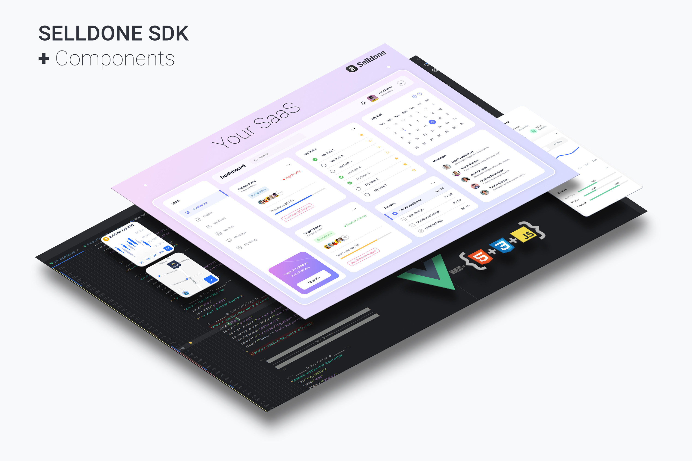

# Selldone ⮕ Storefront SDK

A powerful toolkit that enables developers and entrepreneurs to easily create highly customized ecommerce platforms. In this article, we'll explore the capabilities of the Selldone SDK and how it can revolutionize the ecommerce landscape.

## Selldone SDK - A Comprehensive Toolkit for Custom Ecommerce Development

The Selldone SDK is a comprehensive software development kit that contains all the essential components needed to create an online storefront and manage customer authentication. By utilizing the open-source components provided by the SDK, developers can create custom ecommerce platforms tailored to their specific needs.

## Designed for Ease of Use

Selldone SDK guarantees that even people with a mere three months of JavaScript and HTML experience can create a fully customized online store within a day. This user-friendliness makes it a popular choice for both developers and entrepreneurs, as it significantly lowers the entry barriers in the ecommerce industry.

## Limitless Customization and Application Development

The SDK enables developers to apply any level of customization to the open-source components, allowing them to construct various application layers on top of Selldone. This versatility empowers developers to create highly specialized ecommerce solutions for different verticals and even sell their tailored applications as SaaS products.

## Innovative SaaS Solutions with Selldone SDK

With Selldone SDK, you can create an extensive array of SaaS solutions without penning a single line of backend code. For instance, you could develop a subscription service for marketing analysis that allows users to sell their content through a dedicated user interface tailored to their market. Another possibility is creating a platform to help entrepreneurs sell training courses on their domain through your SaaS and unique paywall user interface - all backed by Selldone.

### Case Study 1: [Host web app on my backend]

I want to create a SaaS platform enabling market analyzers and companies to sell their signals and content on their domain. My to-do list will be:

1. Create an application with Selldone components.
2. Create a website with a home page and onboarding.
3. Define my subscription plans on payment providers (like Stripe), do some coding to sell subscriptions, and host my designed web app.
4. Now my users can subscribe to my service, connect their Selldone shop to it, and offer their services through it.

In this scenario, you directly charge your customers, and you have the flexibility to offer more features to your customers. But also, you should handle adding domains and issuing SSL on your backend.

### Case Study 2: [Host web app on Selldone]

In this scenario, my to-do list will be:

1. Create a custom web app with Selldone components.
2. Register as a SaaS owner on Selldone and verify.
3. Deploy my web app on Selldone and charge users via a subscription fee on Selldone.
4. In this setup, your primary responsibility is to develop a web app (frontend). At the same time, Selldone takes care of all the technical aspects, such as domain management, SSL issuance, and web app hosting. This allows you to focus on creating a unique and engaging user experience while Selldone handles the backend complexities.

### Imagine Then Build by AI + Selldone

Select a vertical that interests you and aligns with your expertise – the more specific and niche, the better. Next, use Midjourny to design your application layer and request code implementation using Selldone Components. Customize the components to match your design by employing AI services such as ChatGPT, BART, or even our built-in AI offerings (with fine-tuned models provided). Finally, launch your new platform-based business and explore the endless possibilities that come with it.

## Author
Pajuhaan