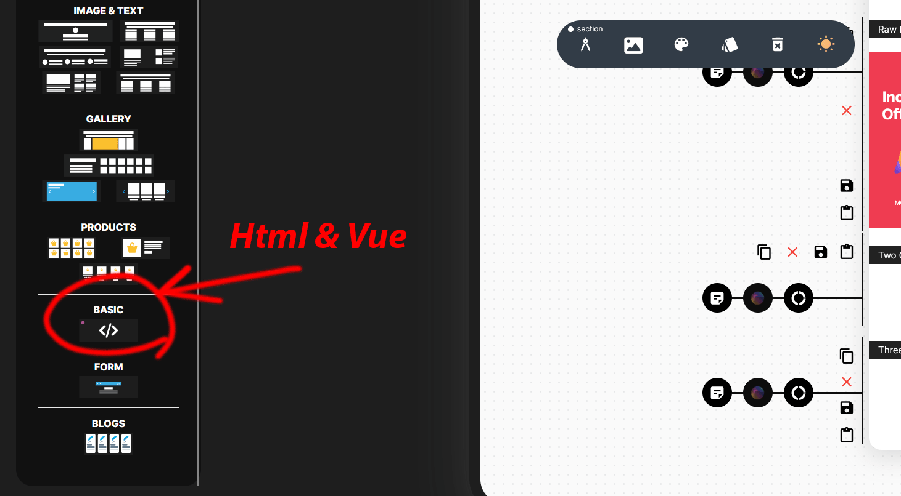
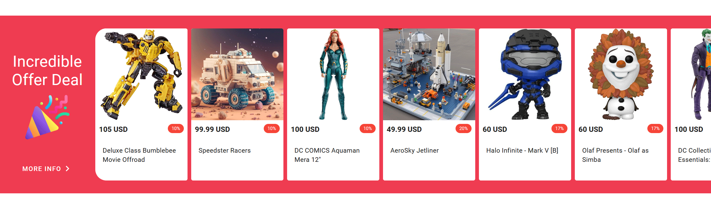

# Storefront SDK Samples
Here you can find an implementation of the storefront SDK for use in any JS frameworks or HTML pages. Additionally, you can discover sample raw code to use in the page builder to create sections.


## How use it in page builder?
To insert these snippets into the page builder, drag and drop the 'Raw HTML Section' and click on the 'Add Custom Code Here' button. Then paste the codes below.




## Products Listing Material

Live code: https://codepen.io/pajuhaan/pen/JjqGBWJ



### Page Builder Code

```html
<!----vue---->
  <v-sheet color="#ef3c51" style="overflow-x: auto;" class="my-5 py-3 py-sm-5 text-start">
    <v-container fluid>
      <v-row class="flex-nowrap" align="stretch">
        <v-col style="min-width: 200px; max-width: 200px" class="text-center d-flex flex-column align-center">
          <v-spacer></v-spacer>
          <div>
            <h4 class="my-3 text-h4">Incredible Offer Deal</h4>
            <v-img src="https://cdn.selldone.com/app/shops/115/pages/1926/images/confettisvg967788a152da6f5a63ca8fef86119157.svg"
                    height="100px" width="100px" class="mx-auto my-3"></v-img>
          </div>
          <v-spacer></v-spacer>
          <v-btn color="#fff" variant="text" :href="`/?search=*&sort=most_popular&filter=${JSON.stringify({only_has_discount: true})}`">
            More Info
            <span class="material-icons">chevron_right</span>
          </v-btn>
        </v-col>
        <v-col v-for="(product, index) in products" :key="index" class="pa-1">
          <v-card style="width: 200px; min-height: 320px; height: 100%" :rounded="index === 0 ? 's-xl' : undefined" flat>
            <v-img :src="getImageUrl(product.icon)" height="200px" cover></v-img>
            <div class="d-flex justify-space-between pa-2">
              <b>{{ product.price }} {{ product.currency }}</b>
              <v-chip color="red" size="x-small" variant="flat">
                {{ Math.round(100 * (product.discount) / (product.price)) }}%
              </v-chip>
            </div>
            <v-card-text class="text-wrap">{{ product.title?.substring(0,80) }}</v-card-text>
          </v-card>
        </v-col>
        <v-col class="pa-1">
          <v-card style="width: 200px; min-height: 320px; height: 100%" rounded="e-xl" class="d-flex flex-column align-center justify-center" flat :href="`/?search=*&sort=most_popular&filter=${JSON.stringify({only_has_discount: true})}`">
            <div style="height: 56px; width: 56px; border-radius: 50%; border: solid thin #eee" class="d-flex align-center justify-center">
              <span class="material-icons">trending_flat</span>
            </div>
            <div class="mt-5">
              View All
            </div>
          </v-card>
        </v-col>
      </v-row>
    </v-container>
  </v-sheet>


<script>
 config = {
  data() {
    return {
      products: [],
      folders: []
    };
  },
  methods: {
    fetchProducts(dir, more, limit, options) {
      window.$storefront.products
        .optimize(600)
        .fetchProducts(dir, more ? this.products.length : 0, limit, options)
        .then(({ products, folders }) => {
          this.products = products;
          this.folders = folders;
        })
        .catch((error) => {
          console.error("Failed to fetch products:", error);
        });
    },
    getImageUrl(path, size) {
      return window.CDN.GET_SHOP_IMAGE_PATH(path, size);
    }
  },
  created() {
 
    this.fetchProducts('*', false, 10, {
      categories_count: 10,
      with_parent: true,
      with_page: true,
      sort: 'random',
      available: false,
      search: null,
      search_type: null,
      dirs: null,
      filter: JSON.stringify({only_has_discount: true}),
      products_only: false,
      categories_only: false,
      with_total: true,
      bounds: null,
      tags: null,
      vendor_id: null,
      surrounded: false
    });
  }
}
</script>
```